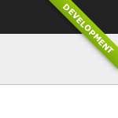
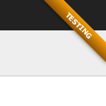
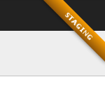
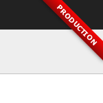
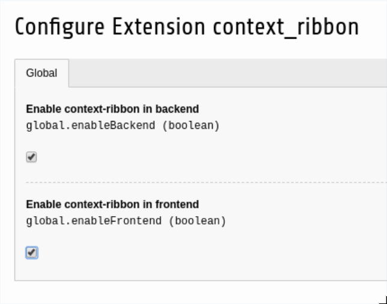

# TYPO3 Extension context_ribbon
## What does it do?

The extension shows a ribbon in the right top corner of the frontend and backend.

It supports the following states:

* Development
* Development/Staging
* Testing
* Production/Staging
* Production

## Usage

Install the extension and set the application context: https://docs.typo3.org/typo3cms/extensions/bsdist/Main/ApplicationContext/Index.html

Restart your webserver server and the ribbon is shown.

You can switch off/on the ribbon in the frontend/backend by changing the extension settings:

The ribbon is hidden in frontend in production context automatically!

## Compatibility

Version tagged with 2.1.0 is compatible with TYPO3 6 up to 9.

Version 3.0.0 is only compatible with TYPO3 10 (PHP >= 7.2).

Versions 10.0.0 and higher are compatible with the corresponding TYPO3 versions.
